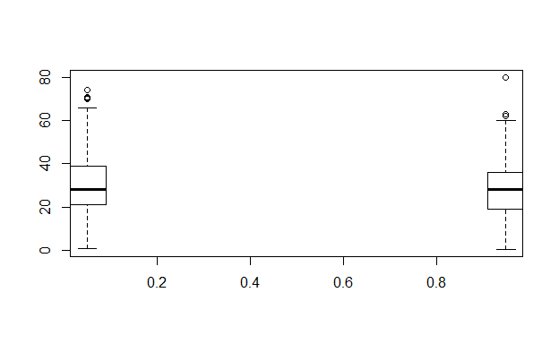
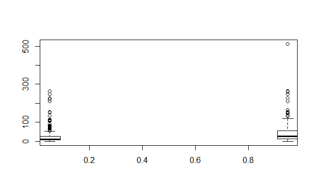
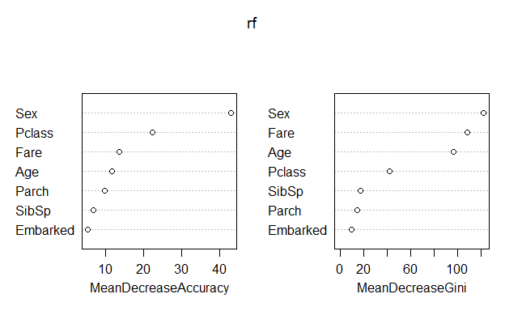
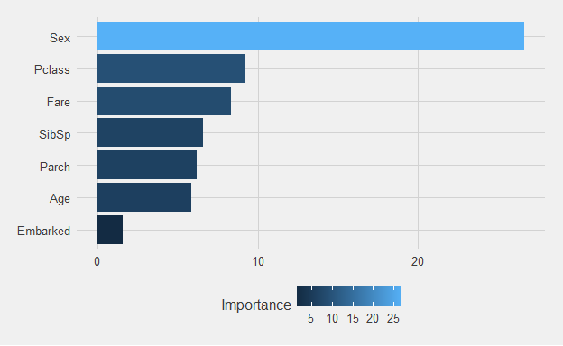

# Predicting Titanic Survivors
Sam Veverka  
20 January 2017  


#Introduction

This script attempts to predict which Titanic passengers survived. More importantly for me, it is my first attempt to use RMarkdown to present data. I intend to keep the prediction process simple, so I will perform little manipulation on the data and will use a fairly basic random forest model. The data is from a kaggle competition, so it includes a training and test set, where the training set observations included if the passenger survived and the test set observations do not.

I used Kaggle user Ben Hamner's "Random Forest Benchmark" kernel as a basis for my data cleaning and user Megan Risdal's "Exploring Survival on the Titanic" kernel as a basis for presentation


# Load Libraries and Data


Load the data, which is pre-sorted into training and test data


```r
set.seed(1) #needed for random forest
train <- read.csv("train.csv", header = TRUE)
test <- read.csv("test.csv", header = TRUE)
```


#Clean and Ready Data for Analysis

```r
names(train)
```

```
##  [1] "PassengerId" "Survived"    "Pclass"      "Name"        "Sex"        
##  [6] "Age"         "SibSp"       "Parch"       "Ticket"      "Fare"       
## [11] "Cabin"       "Embarked"
```

```r
names(test)
```

```
##  [1] "PassengerId" "Pclass"      "Name"        "Sex"         "Age"        
##  [6] "SibSp"       "Parch"       "Ticket"      "Fare"        "Cabin"      
## [11] "Embarked"    "Survived"
```

We can verify that the sole difference between datasets is the Survivors column absent in the test data.


```r
fix(train)
```

It appears several variables are not helpful or atleast not helpful without manipulation or imputation. The ticket column appears to be nonsense at first sight. The values resemble modern ticket values. A lot of values appear to be missing. Perhaps insight can be gained, but it would likely be similar to insight provided by the Fare column. I will drop Cabin as well, as much data is missing. Finally, I will drop Names. There could definitely be useful information in the Names, as family names are tied to ancestral and cultural background, which, especially in the early 1900s, was tied to socio-economic status. However, quantifying that effect is beyond the scope of this script.


The remaining variables appear to be easily related to survival rates.


```r
#Age and Survival
bplot.xy(train$Survived, train$Age)
```

<!-- -->

```r
summary(train$Survived) #quite a few NAs
```

```
##    Min. 1st Qu.  Median    Mean 3rd Qu.    Max. 
##  0.0000  0.0000  0.0000  0.3838  1.0000  1.0000
```

```r
#Fares and Survival
bplot.xy(train$Survived, train$Fare)
```

<!-- -->

The above plots indicate atleast a relationship between Age and Survived and Fares and Survived.

Below is a for loop which extracts the variables I wish to use. Note that imputation must be used on several of the variables. A value of -1 is assigned to those without an age to replace NAs, and the median fare replaces NAs in the Fare column


```r
extractFeatures <- function(data) {
  features <- c("Pclass",
                "Age",
                "Sex",
                "Parch",
                "SibSp",
                "Fare",
                "Embarked")
  fea <- data[,features]
  fea$Age[is.na(fea$Age)] <- -1
  fea$Fare[is.na(fea$Fare)] <- median(fea$Fare, na.rm=TRUE)
  fea$Embarked[fea$Embarked==""] = "S"
  fea$Sex      <- as.factor(fea$Sex)
  fea$Embarked <- as.factor(fea$Embarked)
  return(fea)
}
```

Now, I apply the loop to the training and testing data. Note, that I coerce the training data's "Survived" column to a factor. I also, add a "Survived" column to test data.


```r
train1 <-extractFeatures(train)
test1 <- extractFeatures(test)
train1$Survived <- as.factor(train$Survived)
test1$Survived <- test$Survived
```


Below, I assign the levels of the training "Survived" column to the testing 
"Survived" column so that it can receive prediction values. Also, I use a little trick to make sure that the levels and value types of all columns between the sets are the same. It is not elegant, but it does the job.


```r
levels(test1$Survived) <- levels(train1$Survived)

test1 <- rbind(train1[1, ] , test1)
test1 <- test1[-1,]
```


#Building the Model

To begin with, I will use randomForest function to create my initial randomForest model. I apply the model to the training data with all 7 variables being utilized and 50 trees, which should be sufficient as there are only 418 observations in the test data I am predicting on to.

```r
rf <- randomForest(as.factor(train1$Survived) ~., data=train1,  mtry=7, importance =TRUE, ntree = 50)
pred.rf = predict(rf ,newdata =test1)
summary(pred.rf)
```

```
##   0   1 
## 270 148
```

I would prefer to use a test set where I have the actual survival numbers, so I could calculate errors and use cross-validation to pick the preferred model. Since this data is from a Kaggle competition, I do not. I could cut up the provided training data into two sets, but I would prefer not to when the training data only has double the observations of the testing data.

I will take steps to decided what number of variables I should include. First I run a loop to compare random forests with 1 to 7 variables included. I can not compare errors, but it could still be useful to see how the models vary.


```r
class =matrix(NA, 7,2)
for(i in 1:7){
  fit=randomForest(Survived~.,data=train1, mtry=i, ntree=50)
  pred=predict(fit,newdata =test1)
  class[i,] = summary(pred)
}
class
```

```
##      [,1] [,2]
## [1,]  290  128
## [2,]  288  130
## [3,]  279  139
## [4,]  272  146
## [5,]  272  146
## [6,]  269  149
## [7,]  267  151
```

The models vary, but there is no obvious dropoff. Below are the importance statistics for the variables and simple graph of the importance.


```r
importance(rf)
```

```
##                  0          1 MeanDecreaseAccuracy MeanDecreaseGini
## Pclass    9.155143 17.9969794            22.268882        41.589273
## Age       5.852613 11.9495151            11.526436        96.167598
## Sex      26.664488 35.1711442            43.100272       121.919428
## Parch     6.171831  8.1774651             9.605674        14.128594
## SibSp     6.582240  0.5474021             6.697374        17.109451
## Fare      8.326546  9.5516556            13.486637       108.087936
## Embarked  1.581697  5.9241096             5.282310         9.368641
```

```r
varImpPlot(rf)
```

<!-- -->

It appears that Sex is easily the most important of the variables, especially according to the mean decrease in accuracy when it is omitted.

Below is a more aesthetically pleasing plot of the variable importance

<!-- -->

#Final Model and Prediction
Since multiple entries are allowed, I decided to enter two models, one random forest with six variables and one with one variable. I exclude "Embarked" from the six variable model as it is by far the least useful variable according to the mean decrease in accuracy and Gini. The one variable model includes only "Sex", as that is by far the most important.


```r
rf <- randomForest(as.factor(train1$Survived) ~., data=train1,  mtry=6, importance =TRUE, ntree = 50)
pred.rf = predict(rf ,newdata =test1)
summary(pred.rf)
```

```
##   0   1 
## 268 150
```

```r
solution <- data.frame(PassengerID = test$PassengerId, Survived = pred.rf)               
write.csv(solution, file = "random_forest_submission.csv", row.names=FALSE)


rf1 <- randomForest(as.factor(train1$Survived) ~., data=train1,  mtry=1, importance =TRUE, ntree = 50)
pred.rf1 = predict(rf1 ,newdata =test1)
summary(pred.rf1)
```

```
##   0   1 
## 292 126
```

```r
solution1 <- data.frame(PassengerID = test$PassengerId, Survived = pred.rf1)               
write.csv(solution1, file = "random_forest_2_submission.csv", row.names=FALSE)
```

The model with only "Sex" as the predictor performed better, with a public score of 0.77033, which puts the model in the top half of models submitted. That's not too bad for such a simple model
